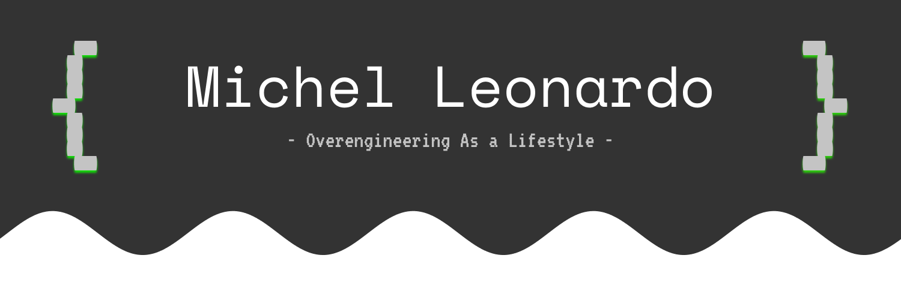

  
    
  

  
  

 

<table align="center" width="100%" style="border: none;">
  <tr>
    <td width="50%" valign="top">
      <h3 align="center">🇺🇸 About Me</h3>
      
Hi, I'm Michel Leonardo. I'm a <strong>Software Engineer</strong> and the creator of <strong>Gambiarra Labs</strong>—a YouTube channel where <em>'Overengineering As a Lifestyle'</em> isn't just a motto, it's the core of my system architecture.

      
My focus is taking complex constraints (or everyday problems) and solving them in the most technical, unconventional, and entertaining way possible, blending low-level code, hardware, and creativity.

      
Behind the scenes, I'm earning my degree in Computer Science at the Catholic University of Brasília and living in the terminal. My daily ecosystem is Fedora Linux running River WM and Neovim, where I spend most of my time studying advanced algorithms, editing videos, and building crazy systems from scratch.

      <blockquote>💡 <strong>If your company needs a Backend Dev to solve impossible problems (without bringing down production), feel free to reach out to me on <a href="https://www.linkedin.com/in/michel-leonardo-892359357/">LinkedIn</a>.</strong></blockquote>
    </td>
    <td width="50%" valign="top">
      <h3 align="center">🇧🇷 Sobre Mim</h3>
      
Olá, me chamo Michel Leonardo. Sou <strong>Software Engineer</strong> e o criador do <strong>Gambiarra Labs</strong>, um canal no YouTube onde <em>"Overengineering As a Lifestyle"</em> não é apenas um lema, é a essência da minha arquitetura de sistemas.

      
Meu foco é pegar restrições complexas (ou problemas do dia a dia) e resolvê-los da maneira mais técnica, não-convencional e divertida possível — unindo código de baixo nível, hardware e entretenimento.

      
Por trás das câmeras, sou graduando em Ciência da Computação na Universidade Católica de Brasília e vivo no terminal. Meu ecossistema diário é um Fedora Linux rodando River WM e Neovim, onde passo a maior parte do tempo estudando algoritmos avançados, editando vídeos e construindo sistemas malucos do zero.

      <blockquote>💡 <strong>Se a sua empresa precisa de um Dev Backend para resolver problemas impossíveis (sem derrubar a produção), sinta-se à vontade para me chamar no <a href="https://www.linkedin.com/in/michel-leonardo-892359357/">LinkedIn</a>.</strong></blockquote>
    </td>
  </tr>
</table>

 

### 🛠️ My Tech Stack

Here are some of the languages, tools, and architectures I'm comfortable with:

| Languages | Architecture & Protocols | Tools & Environment |
| :--- | :--- | :--- |
|           |       |       |

 

### 🚀 Caos em Produção (Featured Projects)

* 🎧 **[Spotify-FS - O Spotify como HD Infinito](https://github.com/xelckis/spotify-fs)**
  *⭐ +445 Stars on GitHub.* I transformed Spotify into an infinite cloud storage drive. By manipulating chunks of data and audio encoding, I forced Spotify to host my personal files via their API using **Go** and heavy concurrency.
